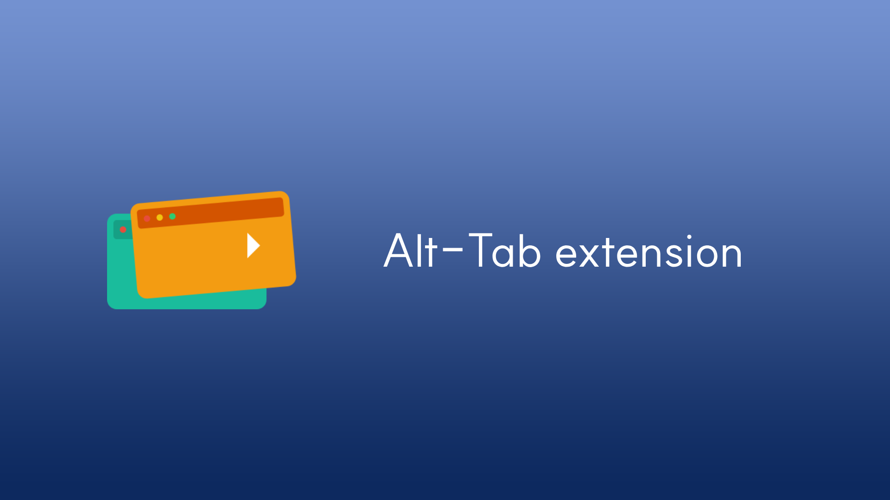

# Alt-Tab

> [!WARNING]
>
> 이 프로젝트는 현재 개발 중입니다.

[![License: MIT][license-image]][license-url]

한국어 | [English](./README.md)

## 개요

Alt-Tab은 클라우드 동기화와 안전한 공유 기능을 제공하는 지능형 탭 관리 브라우저 확장 프로그램 및 웹 애플리케이션입니다. 비활성 상태의 탭을 자동으로 감지하고 저장하여 작업 공간을 깔끔하게 유지하면서 여러 디바이스에서 쉽게 복원할 수 있습니다.

**저장소**
- Frontend: [SimYunSup/alt-tab-extension](https://github.com/SimYunSup/alt-tab-extension)
- Backend: [knight7024/alt-tab](https://github.com/knight7024/alt-tab)

## 모노레포 구조

pnpm 모노레포로 구성되어 있습니다:

- **`packages/extension`** - 브라우저 확장 프로그램 (Chrome, Firefox)
- **`packages/web`** - QR 코드 탭 공유 및 복원을 위한 웹 앱

## 기능

### 브라우저 확장 프로그램

- **자동 탭 관리**
  - 설정한 시간(1-240분) 동안 비활성 상태인 탭을 감지하고 저장
  - 다양한 비활성 감지 모드:
    | 모드 | 설명 | 지원 |
    |------|------|------|
    | window | 윈도우/탭 전환 시 비활성 | 모든 브라우저 |
    | visibility | 탭이 숨겨질 때 비활성 | 모든 브라우저 |
    | idle | 사용자 상호작용이 없을 때 | Chrome/Edge만 |
  - 탭 보호 옵션: 언로드된 탭, 오디오 재생 중인 탭, 고정된 탭, 컨테이너/그룹 탭 무시
- **URL별 커스텀 규칙**
  - URL 패턴을 사용하여 특정 웹사이트에 개별 설정 적용
- **클라우드 동기화**
  - Google OAuth를 통해 여러 디바이스에서 설정과 탭 동기화
- **탭 그룹 아카이빙**
  - 종단간 암호화(PIN 기반, Argon2id + AES-256-GCM)로 탭 그룹 보관
  - QR 코드를 통한 디바이스 간 공유 및 복원

### 웹 애플리케이션

- **QR 코드 탭 복원**
  - QR 코드 스캔으로 공유된 탭 그룹 복원
  - 보안을 위한 PIN 기반 복호화
  - 확장 프로그램 설치 감지 및 안내
  - 확장 프로그램이 없을 경우 직접 탭 열기로 대체

## 개발

### 필수 조건

- Node.js 18+
- pnpm 10+

### 설치

```bash
# 모든 패키지의 의존성 설치
pnpm install
```

### 개발 명령어

```bash
# Chrome에서 확장 프로그램 개발 모드 실행
pnpm dev

# Firefox에서 확장 프로그램 실행
pnpm dev:firefox

# 웹 앱 실행
pnpm dev:web

# 모든 패키지 빌드
pnpm build:all

# 확장 프로그램만 빌드
pnpm build

# 웹 앱만 빌드
pnpm build:web
```

### 패키지별 스크립트

#### Extension (`packages/extension`)

```bash
cd packages/extension

# 개발
pnpm dev              # Chrome
pnpm dev:firefox      # Firefox

# 빌드
pnpm build            # Chrome용 프로덕션 빌드
pnpm build:firefox    # Firefox용 프로덕션 빌드

# 패키징
pnpm zip              # 배포용 .zip 생성
pnpm zip:firefox      # Firefox용 .zip

# 테스트
pnpm test             # 테스트 실행
```

#### Web App (`packages/web`)

```bash
cd packages/web

# 개발
pnpm dev              # 개발 서버 시작

# 빌드
pnpm build            # 프로덕션 빌드

# 미리보기
pnpm preview          # 프로덕션 빌드 미리보기
```

## 환경 변수

### Extension

`packages/extension/`에 `.env` 파일 생성:

```env
# 백엔드 API URL (OAuth 및 API 호출에 필요)
VITE_OAUTH_BASE_URL=http://localhost:8080

# 프로덕션용:
# VITE_OAUTH_BASE_URL=https://your-backend-domain.com
```

### Web App

`packages/web/`에 `.env` 파일 생성:

```env
# 백엔드 API URL
VITE_API_BASE_URL=http://localhost:8080

# 프로덕션용:
# VITE_API_BASE_URL=https://your-backend-domain.com
```

## 기술 스택

### Extension
- **프레임워크**: WXT (브라우저 확장 프레임워크)
- **UI**: React, Tailwind CSS, Radix UI, Lucide React
- **데이터**: Dexie (IndexedDB), webext-bridge (메시징)
- **보안**: hash-wasm (Argon2id), Web Crypto API (AES-256-GCM)
- **언어**: TypeScript

### Web App
- **프레임워크**: Vite, React
- **UI**: Tailwind CSS, Radix UI

### 지원 브라우저
- Chrome / Edge (Manifest V3)
- Firefox (Manifest V2)

## 아키텍처

### 탭 공유 플로우

1. **Extension**: 사용자가 PIN으로 탭 그룹 보관
   - PIN에서 파생된 키(Argon2id)로 탭 데이터 암호화
   - 백엔드 서버로 전송
2. **Backend**: 암호화된 탭 그룹 저장, 공유 URL 생성
3. **QR Code**: 확장 프로그램이 공유 URL이 담긴 QR 코드 생성
4. **Web App**:
   - 사용자가 QR 코드 스캔 → 공유 URL 열기
   - 확장 프로그램 설치 여부 감지 (content script bridge 통해)
   - 사용자가 PIN 입력 → 탭 그룹 복호화
   - 확장 프로그램 또는 직접 브라우저 API를 통해 탭 복원

### Extension-Web 통신

웹 앱과 확장 프로그램 간 통신:
- **Content Script Bridge** (`entrypoints/content/bridge.ts`)
- **window.postMessage** API를 통한 컨텍스트 간 메시징
- 웹 페이지에서 직접 chrome.runtime 접근 불가

## 기여

기여를 환영합니다! 이슈와 Pull Request를 자유롭게 제출해 주세요.

## 문서

- [기술 문서](./docs/README.md) - 상세 아키텍처 및 API 레퍼런스
- [E2EE 아키텍처](./docs/E2EE-ARCHITECTURE.md) - 종단간 암호화 설계

## 라이선스

[MIT](LICENSE.md)

## 참고 자료

- [WXT Framework](https://wxt.dev/)
- [Chrome Extensions API](https://developer.chrome.com/docs/extensions/)
- [Firefox WebExtensions](https://developer.mozilla.org/en-US/docs/Mozilla/Add-ons/WebExtensions)

[license-image]: https://img.shields.io/badge/License-MIT-brightgreen.svg?style=flat-square
[license-url]: https://opensource.org/licenses/MIT
