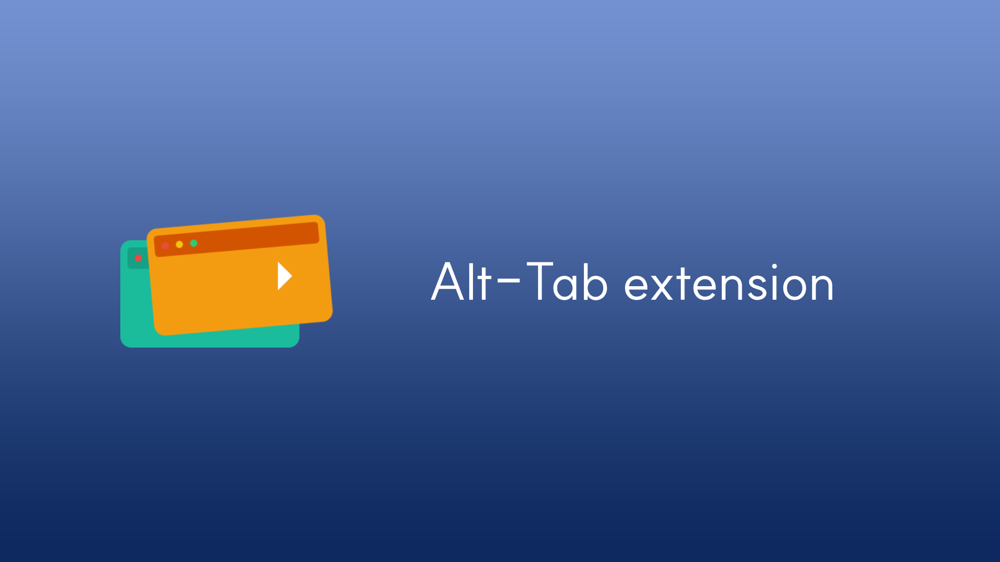

# alt-tab extension

> [!WARNING]
>
> This extension is Working in Progress. Currently developing.

[![License: MIT][license-image]][license-url]

## Overview

Alt-Tab Extension detects when tabs have been inactive for a specified period and automatically stores them, keeping your workspace clean while allowing you to easily restore any tab when needed.

This extension is based on [Server Repository](https://github.com/knight7024/alt-tab) by [knight7024](https://github.com/knight7024)

## Features

- **Automatic Tab Storing**
  - Detects and stores tabs that have been inactive for a defined period.
- **Dynamic Settings Adjustment**
  - Automatically adjusts behavior based on browser activity and inactive tabs.
- **URL-Specific Customization**
  - Utilize URL regex to apply custom settings for specific websites.
- **Device Sync**
  - Sync and share your settings and tabs across devices via Google account authentication.
- **Customizable Timeout**
  - Define your own inactivity duration thresholds.

## Contributing

Will be accesible.

[license-image]: https://img.shields.io/badge/License-MIT-brightgreen.svg?style=flat-square
[license-url]: https://opensource.org/licenses/MIT